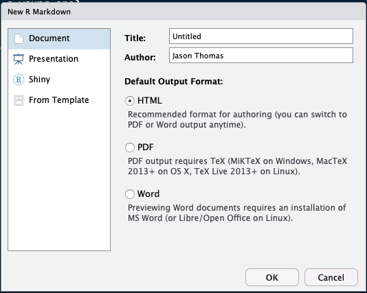

```{r, echo=FALSE, include=FALSE}
library(knitr)
```


# Plan for today

* Background information

* Quick tour of R Studio

* Basics

* More advanced


<!-- Background -->
---
class: wide-slide

# What is 

.left-column[
#### *.red[Background]*

#### .gray[Past, Present, & Future]
]

.right-column[

* .gray[R is an environment & a language]

  + .gray[prepare data, statistical analyses, and graphics]
  + .gray[some of the R software is written using the R language]
  
* Free software available on [CRAN](https://cran.r-project.org/web/packages/available_packages_by_name.html)

  + **C**omprehensive **R** **A**rchive **N**etwork
  + https://cran.r-project.org
  + *free* in both senses of the word
]

---
class: wide-slide
# What is 

.left-column[
#### .gray[Background]

#### *.red[Past], Present, & Future*
]

.right-column[

* Developed in the mid-1990s by statisticians <br> (not computer scientists)

* very flexible language, but can be relatively slow
  + [Hadley Wickham ref.](https://adv-r.hadley.nz/perf-improve.html) that points to...
  + [Serious breakdown ref.](http://r.cs.purdue.edu/pub/ecoop12.pdf)

* [For history buffs](https://cran.r-project.org/doc/html/interface98-paper/paper_2.html)
and [some more](https://www.stat.auckland.ac.nz/~ihaka/downloads/Massey.pdf) 
]


---
class: wide-slide
# What is 

.left-column[
#### .gray[Background]

#### *Past, .red[Present], & Future*
]

.right-column[
* [Packages on CRAN](https://cran.r-project.org/web/packages/available_packages_by_name.html)
  + [Tidyverse](https://www.tidyverse.org/) is worth perusing
  
* No warranty, but
  + active development community (BugRepors on CRAN page; submit issue on GitHub)
  + active user community (e.g., stackoverflow)
  
* [Shiny Apps](https://shiny.rstudio.com/gallery/), 
[dashboards (with Shiny)](https://rmarkdown.rstudio.com/flexdashboard/examples.html),
[Widgets](https://www.htmlwidgets.org/showcase_leaflet.html), & 
[Dynamic Documents](https://rmarkdown.rstudio.com/)

]

---
class: wide-slide
# What is 

.left-column[
#### .gray[Background]

#### *Past, Present, & .red[Future?]*
]

.right-column[

* [The Popularity of Data Science Software](http://r4stats.com/articles/popularity/)

* [TIOBE Index](https://www.tiobe.com/tiobe-index/)

* [Check out the last few slides](https://www.stat.auckland.ac.nz/~ihaka/downloads/Massey.pdf)

]

<!-- R Studio -->

---
class: wide-slide
.left-column[

]
.right-column[
* Background & Quick tour

* Creating and saving a script

* Setting working directory

* Packages & Updates

* R Markdown Example
]


---
class: wide-slide

## Background

.left-column[

]
.right-column[
* R Studio is a separate piece of software that sits on top of regular R
  + **I**ntegrated **D**evelopment **E**nvironment
  
* *Many* useful features
  + Decent script editor (not great, but command/object name completion)
  + Keyboard/menu shortcuts and templates (e.g., R Markdown)
  + Projects, GitHub integration, version control (packrat)
]

---
class: wide-slide

## Scripts & Working Directory

.left-column[

]
.right-column[
* To create a new script, select the menu options:
    + `File` -> `New File` -> `R Script`
    + on the first line type: <br>
    `# My Cool R Script` <br>
    (# denotes a comment) and then `File` -> `Save As...`

* Set the working directory (i.e., the default folder where R Studio will
look for and save files):
    + `Session` -> `Set Working Directory` -> `Choose Directory`
]

---
class: wide-slide

## Scripts & Working Directory

.left-column[

]
.right-column[
### Useful R commands in the console:
  + `getwd()` - print the working directory in the console
  + `dir()` - list the files and folders in the current directory
    + `dir('../')` - list the contents in the parent directory
  + `setwd('/Users/thomas.3912/')` - set the working directory
  to the path in quotes
]    


---

## R Library & Packages

* Packages (with functions, data, and help files) are installed in your library

* In you new script type and evaluate the following command:

```{r eval=FALSE}
library()
```

* This command will list the path to your libraries as well as the contents

  + usually you will have a system library (where the admin install packages) and a user library
  (where the user installs packages)


---
## R Library & Packages (cont.)

* If a package is installed in 2 libraries, see `?library` and the `lib.loc` option, where you can specify
  which library to use

* Let's install the `rmarkdown` package

  + it depends on another piece of software called [`pandoc`](http://pandoc.org): 
  [http://pandoc.org/installing.html](http://pandoc.org/installing.html)

  + Next, in R Studio follow these menu options: <br>
  `Tools` -> `Install Packages`

  + choose a repository and enter `rmarkdown` in the box asking for the Package name
  

---
## R Library & Packages (cont.)

* R (and R Studio) will install all of the dependencies (so after clicking the install
button, you may see a lot of text fly through the console if there are a lot of dependencies)

* Also note the menu option: `Tools` -> `Check for Package Updates...`

  + some packages get updated a few times a year (particularly if it is a young one)

  + if you are running into error messages when using the functions in a package, or something
  doesn't seem right, check if there is an update (and update!)

---

## R Markdown

OK, let's take R for a spin.  Follow the menu options

* `File` -> `New File` -> `R Markdown...`





---

## R Markdown (cont.)


* Provide a title, choose the output you want (HTML is probably best for now), and click OK

  + PDF requires LaTeX

* R Studio provides you with a useful template that we can convert into the output file with
<br> `File` -> `Knit Document`

  + (or click on the ball of yarn and needles icon)

* The `rmarkdown` package is using the `knitr` package to combine you text and code, and then calls on pandoc
to convert the markdown, images, and code into the final output format.  Pretty slick!

---

## R Script: Example data

* Let's go back to our cool R script to learn a little more about the syntax

* We will work with the 2 auto files you can download from:

  <br> [https://www.asc.ohio-state.edu/thomas.3912/software/software.html](https://www.asc.ohio-state.edu/thomas.3912/software/software.html)

* To read these data into R...

  + install the `haven` library
  + use the `read.csv()` function (already installed in base R)
  
---
class: wide-slide
## R Script: Example data

* Make sure the data files are in your working directory (or know the path where they reside).

* Syntax:
  + `objects` hold data
  + `functions(obj, option1 = TRUE, option2 = 13)` do stuff to objects (with option like Stata)

* First, we'll load the `.dta` file

```{r eval = TRUE}
library(haven)                  ## load the haven library
#help(package = "haven")        ## look at haven's help page
#?read_dta                      ## access read_dta()'s documentation
autoDTA <- read_dta('auto.dta') ## create a new object to hold data
                                ## <- is "assignment operator"
```

---
.pre40[
```{r eval = TRUE}
str(autoDTA)                    ## structure of autoDTA
```
]


---
class: wide-slide


```{r eval = TRUE}
dim(autoDTA)          ## print dimensions
names(autoDTA)        ## print variable names
summary(autoDTA$mpg)  ## access a autoDTA variable
```


---
class: wide-slide

.pre40[
```{r eval = TRUE}
table(autoDTA$foreign)  ## basic 1-way table
summary(autoDTA)        ## summarize all variables
```
]

---
class: wide-slide
#### Quick Detour: Data Types & Structures

A few types of data in R

* `logical` - `TRUE` or `FALSE`

  + `NA` - missing data

* `character`

* numeric - `integer`, `double`, `complex`

* `NULL` - empty object (place holder)


---
class: wide-slide
#### Data Structures

* R has different structures for holding data, which can be 
organized by...
    + how many dimensions does it have?
    + do the types of data need to be the same?

* **Vectors**
  1. 1 dimension
  1. same data type
    + special case: **factor** (predefined categories)

* **Matrices**
  1. rows and columns
  1. same data type

---
class: wide-slide
#### Data Structures (cont.)

* **Arrays**

  1. any number of dimensions
  2. same data type

* **Data Frames** (*tibbles* are similar)

  1. rows and columns
  1. different data types

* **Lists**

  1. 1 dimension
  1. different data types (with any dimension)


---
class: wide-slide
#### Access elements within a structure/object:


* vectors: name[position]
```{r}
autoDTA$foreign[3]
```

variables within data frames & tibbles can be accessed with the dollar sign`$`

 + `dfName$varname`


---
class: wide-slide
#### Access elements within a structure/object:

* matrices & data frames/tibbles: name[row, column]
```{r}
autoDTA[c(1, 3), 1]
autoDTA[1:3, 1]
```

---
class: wide-slide
#### Now let's read in the CSV file and run a regression

```{r}
dir()
autoCSV <- read.csv('auto.csv', stringsAsFactors = FALSE)
is.data.frame(autoCSV)
names(autoCSV)
```

---
class: wide-slide

`Formulas` in R: Y ~ X1 + X2

```{r}
model1 <- lm(mpg ~ weight, data = autoCSV)
model1
```

---
class: wide-slide


```{r}
summary(model1)
```

---
class: wide-slide

```{r, fig.width=6, fig.height=5, fig.align='center'}
plot(autoCSV$weight, autoCSV$mpg, main = 'Scatterplot', 
     xlab = 'Weight', ylab = 'Miles / Gallon', 
     col = 'red', pch = 3, cex = 2)
abline(reg = model1, lty = 3, lwd = 2, col = 'green')
text(mean(autoCSV$weight), median(autoCSV$mpg) + 15, 'Hi Mom', 
     col = 'blue', cex = 3)
abline(v = mean(autoCSV$weight), col = 'orange', lty = 2, lwd = 4)
```

---
class: wide-slide

```{r}
names(model1)
model1$coef
summary(model1$fitted.values)
```

---
class: wide-slide


```{r}
names(summary(model1))
summary(model1)$r.squared
```

The $R^2$ for my model is `r round(summary(model1)$r.squared, 3)`.